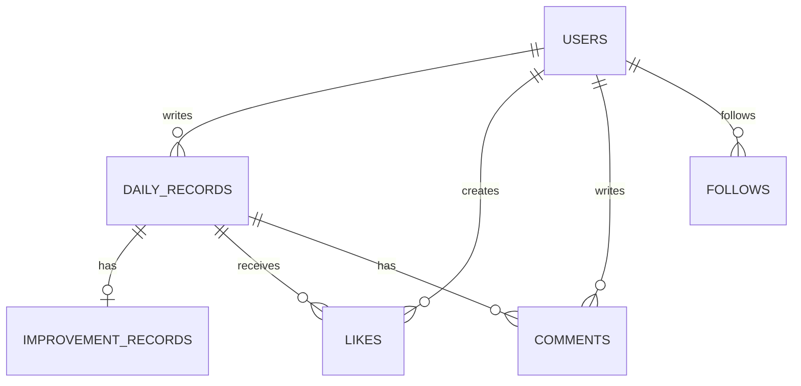

# Kaizen Log

日々の行動を振り返り、次に試す改善策とその結果を記録する Laravel 製Webアプリケーションです。自分の記録を継続的に改善しながら、公開設定や相互フォローを通じて他ユーザーの記録からも学べます。

## 主な機能

- ユーザー登録・ログイン・ログアウト・退会（ユーザーはSoft Delete）
- 日報の作成・一覧・検索・編集・削除（Soft Delete）
- 公開 / 非公開の設定と画像アップロード
- 想定する結果、実施日、実際の結果、A〜D評価による改善記録（作成日を1日目として7日目の23:59まで入力可能）
- 作成から6日目以降の改善結果未入力リマインド
- Communityでの公開日報閲覧
- フォロー / フォロー解除、相互フォロー時の非公開日報閲覧
- Like（論理削除による解除・再Like時の復元）、コメントの投稿・編集・削除
- 改善記録ページでの週ごとの改善行動数、A〜D内訳、期間・評価による絞り込み
- マイページでの今月の改善行動数、未振り返り件数、フォロー、Like済み日報の確認

## アクセス制御の方針

| 操作 | 許可されるユーザー |
| --- | --- |
| 日報の編集・削除・改善結果入力 | 日報の所有者のみ |
| 公開日報の閲覧 | ログイン済みユーザー |
| 非公開日報の閲覧 | 所有者または相互フォローのユーザー |
| Like・コメント | 閲覧可能な他ユーザーの日報のみ |
| コメントの編集・削除 | コメント投稿者のみ |

## 画面と設計の役割

| 画面 | 役割 |
| --- | --- |
| 自分の日報 | 日々の出来事と、次に試す改善策を記録・検索する場所 |
| 改善記録 | 実施日を基準に、改善行動数とA〜D評価を振り返る場所 |
| マイページ | 今月の改善行動数と未振り返り件数を把握し、改善記録へ移動する入口 |
| Community | 公開日報と、相互フォロー相手の非公開日報から学ぶ場所 |

改善記録では、A〜Cを「実施済み」として改善行動数へ数え、Dは未実施として別に扱います。A〜Cは実施日、Dは実施日を持たないため日報日を期間絞り込みの基準にしています。

## データの関係



日報・改善記録・コメント・Like・ユーザーは論理削除を使い、通常の一覧・集計・検索では削除済みデータを除外します。Likeは複合ユニーク制約を維持したまま、再Like時に同じ行を復元します。

## 技術構成

- PHP 8.4 / Laravel 13
- MySQL 8.4
- Nginx
- Docker Compose
- Laravel Pint
- PHPUnit Feature Test

## ローカル開発環境

### 必要なもの

- Docker Desktop または Docker Engine と Docker Compose

### 起動方法

```bash
git clone <repository-url>
cd portfolio_kaizen_log
cp .env.example .env
docker compose up -d --build
docker compose exec app composer install
docker compose exec app php artisan key:generate
docker compose exec app php artisan migrate
```

ブラウザで `http://localhost:8280` を開きます。

> `.env` には接続情報やAPP_KEYが含まれます。Git管理や公開リポジトリへの登録はしないでください。

## テストとコードスタイル

テストはSQLiteのインメモリDBを使用するため、ローカルMySQLのデータを初期化しません。

```bash
docker compose exec app php artisan test
docker compose exec app ./vendor/bin/pint --test
docker compose exec app php artisan view:cache
```

## ディレクトリ構成

```text
portfolio_kaizen_log/
├── infra/                 # PHP・MySQL・NginxのDocker設定
├── src/
│   ├── app/               # Controller、Model、Policy、FormRequest
│   ├── database/          # Migration、Factory、Seeder
│   ├── resources/views/   # Bladeテンプレート
│   └── tests/Feature/     # 主要機能のFeature Test
├── docker-compose.yml
└── docker-compose.prod.yml
```

## 本番公開前の確認

- `APP_ENV=production`、`APP_DEBUG=false` を設定する
- HTTPSを有効にし、HTTPS環境では `SESSION_SECURE_COOKIE=true` を設定する
- DB・メールなどの認証情報を本番用に発行し、過去に利用した値は再利用しない
- `php artisan test` と `./vendor/bin/pint --test` の成功を確認する
- GitHub Actionsのチェックが成功していることを確認する

## 今後の改善候補

- メール認証の導入可否の検討
- ログイン試行制限の継続的な監視
- 利用データ増加後のクエリ分析とインデックス最適化
- 改善率グラフ生成処理の専用クラスへの分離

## コメント内容の安全性に関する既知の制約

コメント投稿時には、明確にユーザーを傷つけるおそれがある一部の表現をサーバー側で検査しています。ただし、禁止語の検査だけでは文脈を含むすべての攻撃的・差別的・脅迫的・性的嫌がらせ表現を防ぐことはできません。公開運用時は通報機能や人による確認を追加することを検討します。
